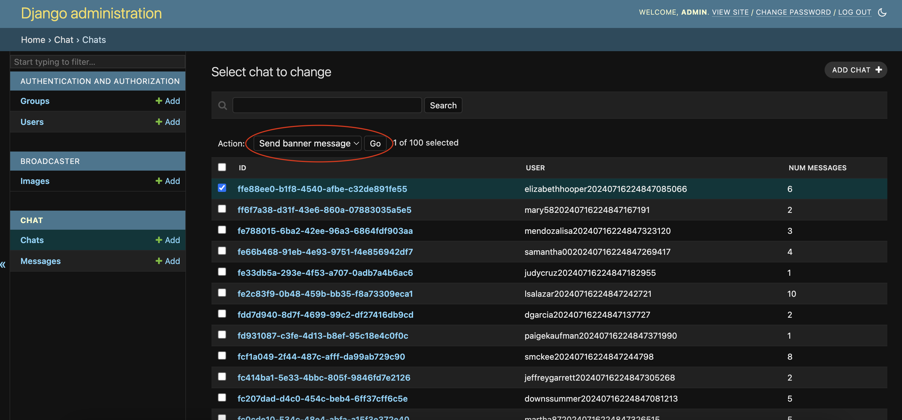

To have the project running in your local:
```console
make docker/run
```
Admin will be at http://localhost:8000/admin/ and you can access it through `admin 12345`

To send a broadcast message to all chats with a photo you need to use the action `Send banner message`

You must select at least one chat, it doesn't really matter which chats you select because the action would send the message to all chats anyway, this is a small inconvenience to not complicate the code.



To run unit tests you can do:
```console
make docker/tests
```

To create fake chats and messages, use the following command (change `total` argument to your liking)
```console
make docker/create-fake-chats total=1000
```
